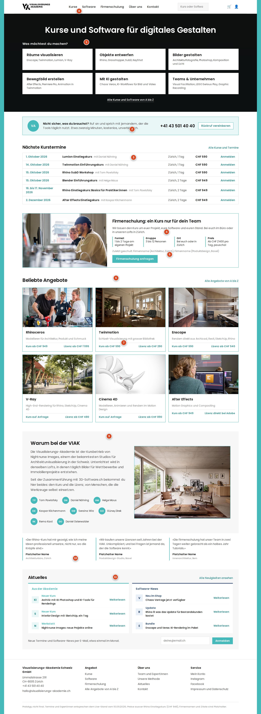
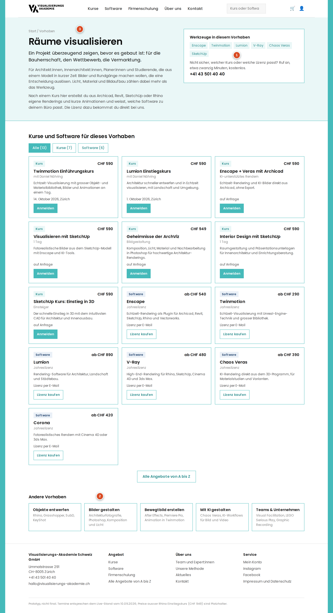
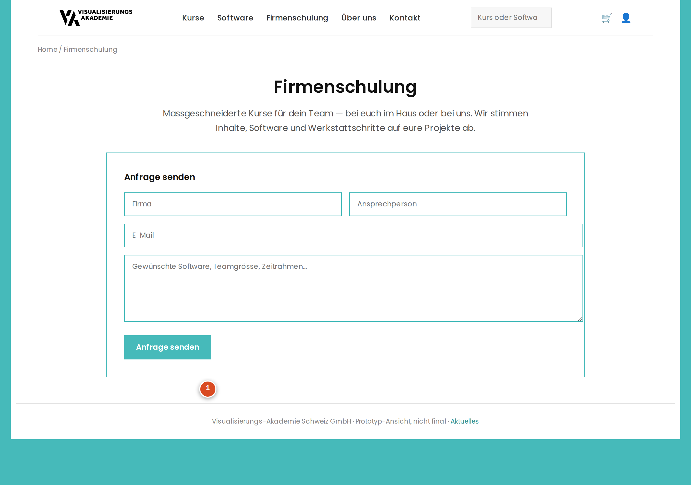
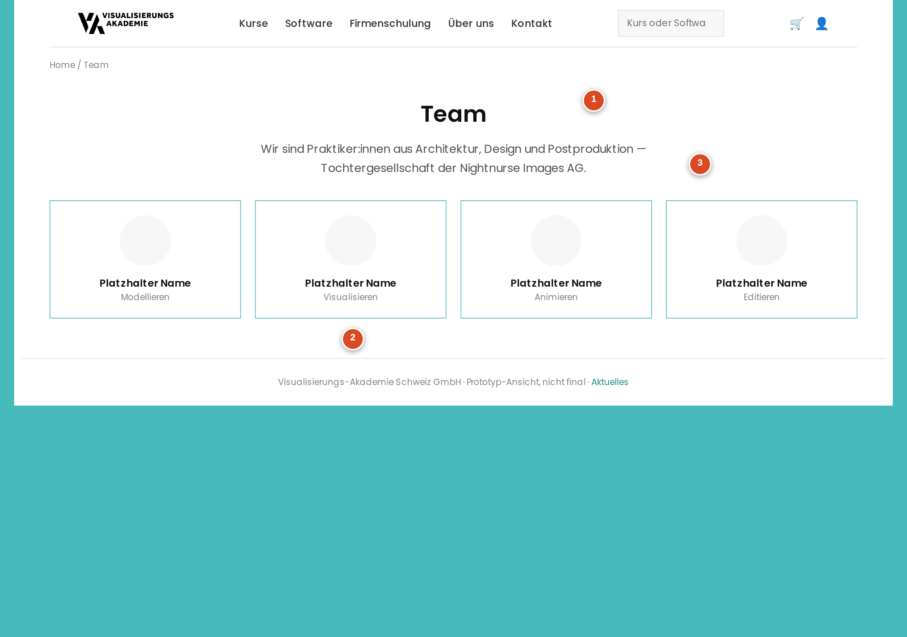
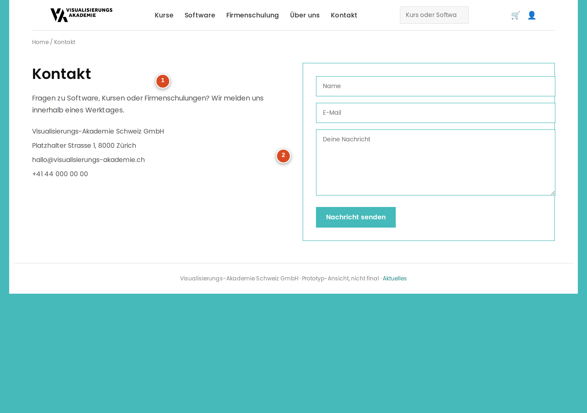

# Screen-Review viak.ch — Rework

Kundencall vom 23. September 2026 · 24 Screens der Mockups unter `.rework/history/mockup/`
Erfasst im Review-Tool: https://claude.ai/artifact/GiNvcrc9AieZLkaQPmZLMh

## Stand

| Entscheid | Screens |
| --- | --- |
| umsetzen (5) | Alle Angebote, Kurse, Software, Team, Kontakt |
| teilweise umsetzen (1) | Aktuelles |
| nicht umsetzen (3) | Unsere Methode, Rhino Einstiegskurs, After Effects Einstiegskurs |
| offen (15) | Homepage, Bilder gestalten, Räume visualisieren, Objekte entwerfen, Bewegtbild erstellen, Mit KI gestalten, Teams & Unternehmen, Rhinoceros, Twinmotion, Was ist Twinmotion?, After Effects, Was ist After Effects?, Firmenschulung, Mein Konto, Twinmotion Lizenzen |

Marker sind nummerierte Punkte im Mockup. Die annotierten Screenshots dazu liegen in `marker/`, die Koordinaten (Designbreite 1280 px) in `screen-review.json`.

## Einstieg & Orientierung

### Homepage

`Homepage.html` · **offen**

1. Element für Startseite mit 'Vorhaben'-Picker
2. Text statisch hinterlegen
3. Autom. Widget
4. Teaser mit Formular
5. Flag auf Kurs (Anzeige auf Detailseite)
6. Widget auf Startseite
7. Kurs und Lizenz zusammen
8. Angebot statt Kurse / Software, Firmenschulung kein Menüpunkt
9. About Modul (Kursleiter optional), Link auf über uns
10. Testimonials als Backend Modul ersetzt bestehende Google Rez.
11. Blog?

### Unsere Methode

`Methode.html` · **nicht umsetzen**

Keine weiteren Anmerkungen.

### Aktuelles

`Aktuelles.html` · **teilweise umsetzen**

Notiz: Blog-Einstieg, noch offen

## Vorhaben

### Bilder gestalten

`Vorhaben-Bilder.html` · **offen**

Im Call nicht einzeln besprochen.

### Räume visualisieren

`Vorhaben-Raeume.html` · **offen**

1. kann weggelassen werden
2. nicht notwendig
3. Seiten anlegen und mit Titel und Text

### Objekte entwerfen

`Vorhaben-Objekte.html` · **offen**

Im Call nicht einzeln besprochen.

### Bewegtbild erstellen

`Vorhaben-Bewegtbild.html` · **offen**

Im Call nicht einzeln besprochen.

### Mit KI gestalten

`Vorhaben-KI.html` · **offen**

Im Call nicht einzeln besprochen.

### Teams & Unternehmen

`Vorhaben-Teams.html` · **offen**

Im Call nicht einzeln besprochen.

## Angebot & Übersichten

### Alle Angebote

`Alle-Angebote.html` · **umsetzen**

Keine weiteren Anmerkungen.

### Kurse

`Kurse.html` · **umsetzen**

Keine weiteren Anmerkungen.

### Software

`Software.html` · **umsetzen**

Keine weiteren Anmerkungen.

## Software

### Rhinoceros

`Rhino.html` · **offen**

Im Call nicht einzeln besprochen.

### Twinmotion

`Twinmotion.html` · **offen**

Im Call nicht einzeln besprochen.

### Was ist Twinmotion?

`Twinmotion-Ueberblick.html` · **offen**

Im Call nicht einzeln besprochen.

### After Effects

`After-Effects.html` · **offen**

Im Call nicht einzeln besprochen.

### Was ist After Effects?

`After-Effects-Ueberblick.html` · **offen**

Im Call nicht einzeln besprochen.

## Kurse & Schulung

### Rhino Einstiegskurs

`Rhino-Einstiegskurs.html` · **nicht umsetzen**

Notiz: Existiert bereits

### After Effects Einstiegskurs

`After-Effects-Einstiegskurs.html` · **nicht umsetzen**

Keine weiteren Anmerkungen.

### Firmenschulung

`Firmenschulung.html` · **offen**

1. Rezensionen anzeigen

## Konto & Lizenzen

### Mein Konto

`Meine-Lizenzen.html` · **offen**

Im Call nicht einzeln besprochen.

### Twinmotion Lizenzen

`Twinmotion-Lizenzen.html` · **offen**

Im Call nicht einzeln besprochen.

## Über uns

### Team

`Team.html` · **umsetzen**

1. Text 'Über uns'
2. Experten Listing
3. Team

### Kontakt

`Kontakt.html` · **umsetzen**

1. Verlinken mit Firmenschulung
2. Hinzufügen

